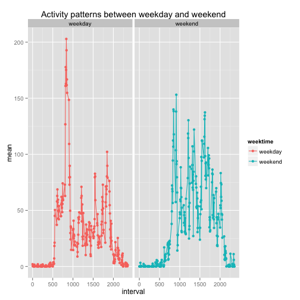

**Loading and preprocessing of data**

The dataset required for this assignment can be downloaded from the following [link](https://d396qusza40orc.cloudfront.net/repdata%2Fdata%2Factivity.zip)

The first step after the file is downloaded is to set the correct working directory folder. In this case, I chose a folder within Documents called RRAssignment1 followed by assigning the download date
to a variable.


```r
setwd("~/Documents/RRAssignment1")
dateDownloaded <- date()
```

The next step is to read the csv. Because we are using tables, we need to import the needed library.
Since the file is a csv, the separator is "," and because it contains a header with the name of the columns, we must set the variable header to true.

```r
library(data.table)
DT <- fread(input="activity.csv", sep=",", header = TRUE)
DT$date <- as.Date(DT$date)
```


**What is mean total number of steps taken per day?**

For this part we will ignore the missing values. We will make a histogram of the total number of steps taken per day and calculate and report the mean and median for each day. For clarity, we will create a new table without the NA entries.


```r
dataIgnoreNA <- na.omit(DT)
```

Now, we will create a new vector called dailySteps which has the total amount of steps taken each day and after it is created, convert it to a dataframe.

```r
dailySteps <- rowsum(dataIgnoreNA$steps, format(dataIgnoreNA$date, '%Y-%m-%d'))
dailySteps <- data.frame(dailySteps)
```

Plot the histogram

```r
 hist(dailySteps$dailySteps, breaks = nrow(dailySteps), xlab = "Daily steps", main = "Histogram of daily steps")
```

 

Mean and median

```r
meanDailySteps <- mean(dailySteps$dailySteps)
medianDailySteps <- median(dailySteps$dailySteps)
```

The mean is: 1.0766 &times; 10<sup>4</sup>

The median is: 10765

**What is the average daily activity pattern?**

To obtain the average daily activity pattern we will make use of the plyr library, in particular the ddply function. This function will split the data frame by the intervals and summarize the steps by their mean.

For more information about this function write the following line:

```r
?ddply
```


```r
library(plyr)
intervalSteps <-  ddply(dataIgnoreNA,~interval, summarise, mean=mean(steps))
```

The plot of the steps mean vs the intervals


```r
plot(intervalSteps, type = "l", main = "Average steps taken across 5 minutes intervals" ,xlab = "5 minutes intervals", ylab = "Average number of steps")
```

 


The max mean and its interval:


```r
whichIsMax <- which.max(intervalSteps$mean)
intervalSteps[whichIsMax, ]
```

```
##     interval  mean
## 104      835 206.2
```


**Imputing missing values**

In this section we will deal with the missing values (coded as NA) of the data set.
The first step, will be counting the amount of missing values.


```r
table(is.na(DT) == TRUE)
```

```
## 
## FALSE  TRUE 
## 50400  2304
```

As we can see, there are 2304 missing values.

The next step is to create a new data set filling in all the missing values. This will be done by replacing the NA value in the interval with the mean value of the day. The first step will be creating a copy of the original data set.


```r
copyDT <- DT
```

Followed by a for loop that will replace the values.


```r
for (i in 1:nrow(DT)){
     if(is.na(DT$steps[i])){
         copyDT$steps[i] <- DT[[as.character(DT[i, "interval"])]]
     }
 }
```

A histogram showing the results.


```r
dailyStepsNew <- rowsum(copyDT$steps, format(copyDT$date, '%Y-%m-%d'))
dailyStepsNew <- data.frame(dailyStepsNew)
hist(dailyStepsNew$dailyStepsNew, xlab = "Daily steps", main = "Histogram of daily steps")
```

 

Mean and median

```r
meanDailyStepsN <- mean(dailyStepsNew$dailyStepsNew)
medianDailyStepsN <- median(dailyStepsNew$dailyStepsNew)
```

The mean is: 9354.2295

The median is: 10395

**Are there differences in activity patterns between weekdays and weekends?**

For this section we will make use of the sqldf library to assign values to variables using SQL-like queries.


```r
library(sqldf)
```

Then we will make use of an if-else statement to create a new column which will whose entries will be "weekend" if the day of the observation corresponds to a day of weekend or weekday if it is a day of the week.


```r
copyDT$weektime <- as.factor(ifelse(weekdays(copyDT$date) %in% 
                                      c("Saturday","Sunday"),"weekend", "weekday"))
```

Now a new table will be created with the average value for each interval during weekend and weekdays.


```r
weekMean <- sqldf(   
   'SELECT interval, avg(steps) as "steps mean", weektime
    FROM copyDT
    GROUP BY weektime, interval
    ORDER BY interval')
```

The final step will be to create the plot to look for the differences between the activity patterns between weekdays and weekend. For this, we will use the ggplot2 library.


```r
library(ggplot2)
```


```r
names(weekMean) <- c("interval", "mean", "weektime")
g = ggplot(data = weekMean, aes(x = interval, y = mean, color = weektime)) + facet_grid(. ~ weektime)
g + geom_line(aes(group = weektime)) + geom_point() + guides(fill = F) + ggtitle("Activity patterns between weekday and weekend")
```

 
